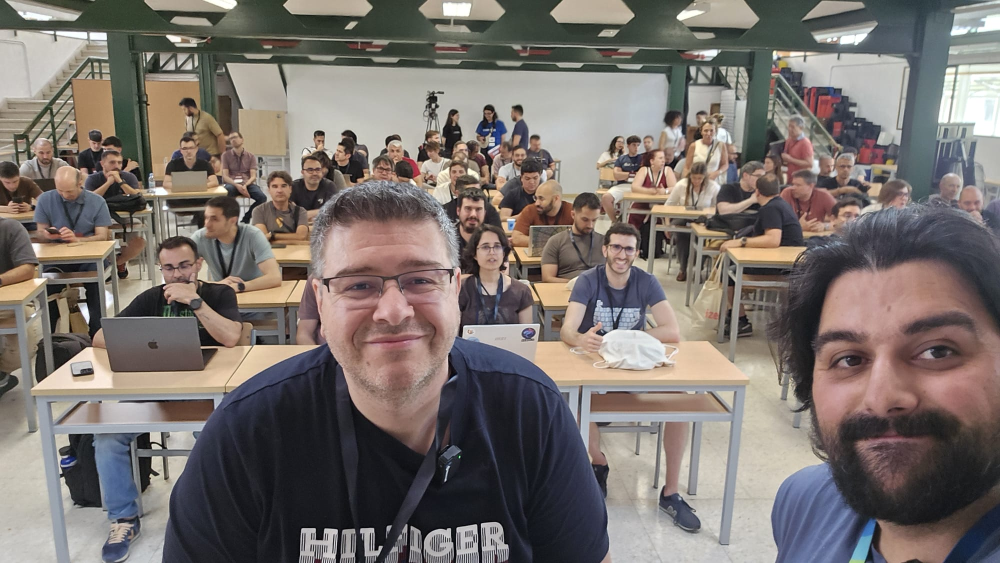

# Arquitectura Multiagentes (Hospital) - CommitConf 2026



Repositorio de demos de la sesion de comunidad para **CommitConf 2026** sobre patrones de arquitectura multiagente con **Microsoft Agent Framework**, usando una narrativa de hospital para workshops.

## Sobre CommitConf 2026

La edicion 2026 se celebro los dias 5 y 6 de junio.

- Sitio oficial: https://commit-conf.com
- Agenda 2026: https://koliseo.com/commit/2026/agenda

## Contenido del repositorio

Este README esta orientado a los notebooks principales de la sesion y al material necesario para ejecutarlos.

## Notebooks del workshop

### 1) Sequential pattern
Archivo: `1_Sequential_pattern_hospital.ipynb`

Demuestra un flujo secuencial de dos fases en Urgencias:

1. `EnfermeriaTriaje` estructura el caso y prioriza.
2. `MedicoUrgencias` propone plan clinico inicial.

Ideal para pipelines con pasos fijos (A -> B).

### 2) Concurrent pattern
Archivo: `2_Concurrent_Pattern_hospital.ipynb`

Demuestra ejecucion en paralelo de varios agentes con el mismo input:

- `ResponsableSistemas`
- `DireccionMedica`
- `SeguridadPaciente`

Ideal para obtener perspectivas simultaneas y reducir tiempo de respuesta.

### 3) Handoff pattern
Archivo: `3_handoff_pattern_hospital.ipynb`

Demuestra delegacion dinamica entre agentes:

- `CoordinadorUrgencias` evalua riesgo.
- Deriva a `EquipoAsistencial` o directamente a `RegistroClinico`.
- Siempre finaliza con trazabilidad en bitacora.

Ideal para escalado condicional y rutas segun contexto.

### 4) Magentic pattern
Archivo: `4_Magentic_pattern_hospital.ipynb`

Demuestra coordinacion iterativa con manager:

- `CoordinadorClinico` planifica y decide rondas.
- `Diagnostico` y `Tratamiento` aportan por especialidad.
- Se consolida un resultado final accionable.

Ideal para problemas complejos con iteraciones.

### 5) Group Chat pattern
Archivo: `5_group_chat_pattern_hospital.ipynb`

Demuestra deliberacion multirol moderada por manager:

- `Jefe_Guardia` coordina la conversacion.
- Intervienen `Medico_Urgencias`, `Supervision_Enfermeria` y `Farmacia_Hospitalaria`.

Ideal para consenso operacional en varias rondas.

## Requisitos

Dependencias definidas en:

- `requirement.txt`

## Setup local (Windows / PowerShell)

### 1) Crear entorno virtual

```powershell
python -m venv .venv
```

### 2) Activar entorno virtual

```powershell
Set-ExecutionPolicy -Scope Process -ExecutionPolicy RemoteSigned
.\.venv\Scripts\Activate.ps1
```

### 3) Instalar librerias

```powershell
pip install -r requirement.txt
```

## Configuracion de variables de entorno

1. Copia `.env.example` a `.env`
2. Rellena los campos con **tus propios valores** (endpoint, deployment y api key)
3. No subas tu `.env` real al repositorio

Ejemplo:

```powershell
Copy-Item .env.example .env
```

## Material adicional

- Slides de la sesion:
  - `recursos/Commit 2026-Arq Multiagentes.pdf`

## Ejecucion

Abre cada notebook en orden sugerido (1 a 5) y ejecuta celdas secuencialmente tras configurar `.env`.
